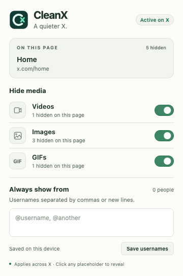
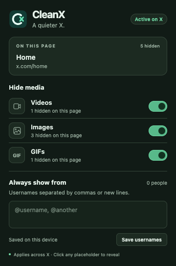
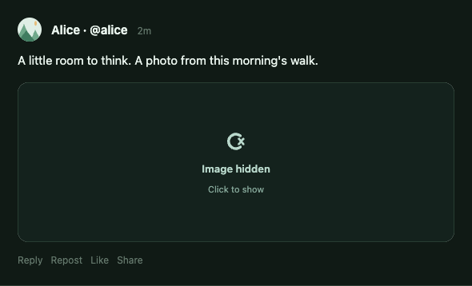

<div align="center">
  
  <h1>CleanX</h1>
  <p>A quieter X.</p>
</div>

[](https://github.com/viseshrp/cleanx/actions/workflows/ci.yml)

Replace videos, images, and GIFs on **x.com** with calm, clickable placeholders.
Keep the text. Choose whose media you always want to see.

<p align="center">
  
  
</p>

## What it does

- Three independent switches for videos, images, and GIFs. All start on.
- A popup with the current X page and counts of media currently hidden in that page's loaded content.
- Click a placeholder to reveal that item. Click **Hide** to hide it again. Temporary reveals reset when the page reloads.
- Save usernames to always show their media. Names are case-insensitive, with or without `@`. Quoted posts use their own author.
- Settings apply immediately across open X tabs and persist on this device. The toolbar action is disabled on other sites.

Photos, link-preview images, ordinary videos, and X's video-encoded GIFs are covered,
including thumbnails in profile and search media grids.
Avatars, profile banners, post text, links, and engagement controls remain available.
The interface is English only and follows the system's light or dark theme.



Screenshots use fictional test posts. No account data is included.

## Install locally

Requires Node.js 22 or newer, pnpm 10, and Chrome 120 or newer.

```sh
git clone https://github.com/viseshrp/cleanx.git
cd cleanx
pnpm install --frozen-lockfile
pnpm build
```

1. Open `chrome://extensions` and enable **Developer mode**.
2. Click **Load unpacked** and select `.output/chrome-mv3` in this repository.
3. Open or reload [x.com](https://x.com), then click CleanX in Chrome's extensions menu. Pin it for easier access.

After changing code, rebuild, click **Reload** on CleanX in the extension manager,
and reload the X tab. An X tab opened before installation can also be connected
using **Reload this X tab** in the popup.

A ZIP is available from successful main-branch [CI runs](https://github.com/viseshrp/cleanx/actions/workflows/ci.yml)
and from [GitHub releases](https://github.com/viseshrp/cleanx/releases) when published.
Extract a ZIP before loading it as an unpacked extension.

## Develop and verify

The project reuses the structure and toolchain from
[TabMD](https://github.com/viseshrp/tabmd) and [NuffTabs](https://github.com/viseshrp/nufftabs).
See the [reuse record](docs/reuse.md) for the copied files and adaptations.

```sh
pnpm dev          # WXT development browser and rebuilds
pnpm quality      # TypeScript and Biome
pnpm test         # Unit/integration tests with a 90% coverage gate
pnpm test:e2e     # Production extension in Chromium against local fixtures
pnpm package      # ZIP and manifest/size checks
```

Install the test browser once with `pnpm exec playwright install chromium`.
`pnpm icons:generate` regenerates the PNG sizes from the SVG drawing in
`scripts/generate-icons.mjs`, using the same rendering pipeline as TabMD.

```text
entrypoints/
  background/    X-only toolbar activation
  content/       Media discovery, placeholders, playback handling
  popup/         The only extension page
  shared/        Settings, page-context types, theme
public/icon/     SVG master and seven PNG sizes
scripts/         Icon generation, artifact checks, tag versions
tests/           Unit, integration, and production-extension browser tests
docs/            Architecture, privacy, testing, release instructions
```

WXT builds the extension. The shipped UI uses native HTML, CSS, TypeScript, and
Chrome APIs with **zero runtime dependencies**. There are no options, new-tab,
welcome, or translation pages. CI limits the ZIP to 100 KiB.

## Behavior and limits

CleanX hides media and pauses blocked videos. X may still fetch or buffer media;
this is a visibility filter, not a network or bandwidth blocker. Placeholders
keep the original media space so the timeline does not jump when media is revealed.

Detection uses X's rendered markup and explicit GIF indicators, including its
GIF thumbnail URLs. X can change that markup. An unidentified video is treated
as a video; looping and muting alone do not make it a GIF. Whitelisting requires
a recognizable author and never guesses from a mention in the post text.

## Project notes

| Topic | Document |
| --- | --- |
| Runtime and permissions | [Architecture](docs/architecture.md) |
| Defaults and storage | [Storage](docs/storage.md) |
| Automated and live checks | [Testing](docs/TESTING.md) |
| CI and releases | [Releasing](docs/releasing.md) |
| Privacy and store copy | [Privacy policy](docs/PRIVACY_POLICY.md) · [Store listing draft](docs/CWS_LISTING_DRAFT.md) |

[MIT](LICENSE). CleanX is independent of X Corp.
